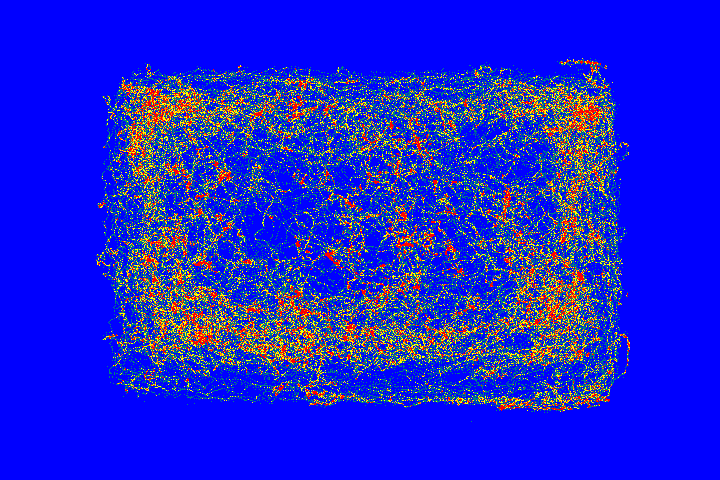
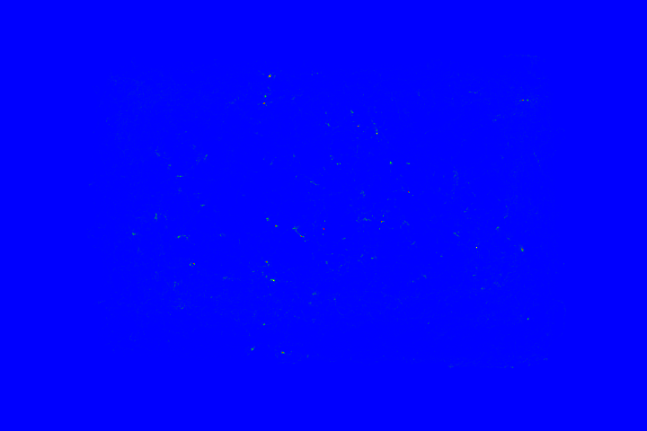
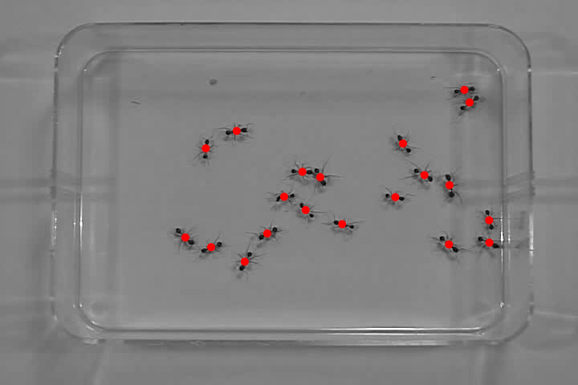

# Simulating Ant Movement

## Ant Colony Simulation

## Other Visualizations

### Heat Map

This is just a simple heat map of where ants traveled during the course of the video.

This is a heat map with a different color gradient. It is interesting that in the full heat map, the ants clearly appeared to travel more around the outside edge of the dish, but in this map, they can be seen traveling through the center equally as often as around the outside.

## Similar Size K Means Clustering Algorithm

In order to find the ant locations in each frame, I clustered on points of certain grey intensities. I found that the K Means algorithm often produced clusters with centers that did not correspond to apparent ant locations. I imagine that this is a result of the nature of the initialization of the starting k points, where depending on the proximity of the closest points to dense groupings of ants, it could be that the cluster centers converge with multiple ants in one cluster.

There is a known Same Size K Means algorithm that works to combat this already, but this would not work for me. The 20 ants each have different amount of pixels that they consume in each photo and searching for clusters of the same size wouldn't produce the results that I wanted. This algorithm isn't native to Scala and I didn't end up implementing it, so I am not able to compare it in application.

This led me to developing a [Similar Size K Means](https://github.com/eherbert/SimulatingAntMovement/blob/master/src/main/scala/utility/SimilarSizeKMeans.scala) clustering algorithm. It works by running a normal K Means and then checking to see if the clusters are evenly weighted. If they are, it returns the cluster centers. If they are not, it moves the cluster centers from the smallest sized clusters to random points from the largest sized clusters, effectively splitting them. You pass the algorithm a stdDevBreakpoint and a stdDevTolerance where the clusters are deemed evenly weighted if the standard deviation is below the stdDevBreakpoint and where, if they are not evenly weighted, the clusters larger than the average cluster size + standard deviation * stdDevTolerance are targeted for splitting. Normal K Means is run again and this process repeats until the converged cluster centers from the K Means algorithm are evenly weighted.

Here are the results of K Means compared to results of Similar Size K Means, red dots represent found cluster centers.

K Means:

Similar Size K Means:

There are quite a few things that need improving with this algorithm though. Firstly, it is very slow and gets even slower the more clusters you run it with. Secondly, occasionally clusters will get abandoned such that no points are closest to a cluster center and that cluster is lost. I imagine this happens when there are two large clusters next to one another and the random data points selected to split them are such that all the data points in the two clusters are then closest to one of the two's original centers and the two new random centers. I could have fixed this by manually checking that there were the same number of clusters each run, but I didn't really want to do that.

It would be interesting to write a version of this were instead of moving the centers from the smallest clusters it moved the centers from clusters closest together. This might even produce better results, as I can see a case where one ant is very small and it is always considered the smallest cluster, even when another ant is in two clusters elsewhere. I also would like to try initializing the clusters with the kmeansII algorithm instead of just randomly.

This portion of the project ended up being what I spent most of my time on and was probably the portion that I was satisfied with, which is unfortunate becase I did not use this algorithm in my colony simulation. To run on one image the Similar Size K Means takes ~30 seconds. With over 10000 images, it would have taken ~83.3 hours to find the centers of each one. Not a long time by science standards but a very long time by end of semester project standards.